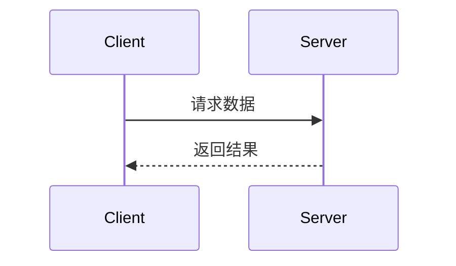

# API 文档模板

> 说明：本模板用于统一接口文档格式，但**不是每个接口都必须完整填写所有章节**。请根据接口类型选择性保留；以下带“可选”的章节可按需省略。

## 文件命名与接口标题编号（强制）

| 项 | 约定 |
|---|---|
| 文件路径 | `docs/api/modules/NN-{{REPO_NAME}}-{domain}.md`（或团队约定前缀） |
| 序号 `NN` | 两位数字，与 [`../api.md`](../api.md)「模块文档」表顺序一致；**新增模块**取当前最大序号 +1，并同步更新 `api.md` 与 `modules/README.md` |
| 接口章节标题 | `## N. 标题`（例：`## 1. Admin 全量工具列表`） |
| 接口子标题 | 接口节内统一用 `###`：`### 功能逻辑`、`### 请求参数`、`### 响应参数` 等（**禁止**用 `## 功能逻辑`，避免与接口标题同级偏大） |
| 编号范围 | **仅**含 `**接口地址**`（或等价 REST 端点节）的接口章节；从 1 起按正文出现顺序编号 |
| 不编号 | `变更记录`、`公共约定`、附录、Tool 说明、配置项、文档同步规则等非接口节 |

新增接口时：在对应模块文末（或合适位置）追加下一序号章节，并视情况更新 `api.md` 接口数。

## 1. 接口标题

**功能描述：** 详细描述接口的业务用途  
**接口地址：** /api/endpoint  
**请求方式：** GET/POST  
**适用范围：** 普通 CRUD / Chat / Stream / Milvus / Neo4j / Sync / Tool / Workflow / Speech

## 是否需要补充的内容

| 章节 | 是否必填 | 适用场景 |
|---|---|---|
| 前置条件 | 可选 | 需要说明鉴权、配置开关、外部依赖时填写 |
| 变更记录 | 必填 | 所有接口都需要保留 |
| 功能逻辑 | 必填 | 所有接口都需要保留 |
| 请求参数 | 必填 | 所有接口都需要保留 |
| 响应参数 | 必填 | 所有接口都需要保留 |
| 错误与边界 | 可选 | 复杂接口、对外依赖接口、流式接口建议填写 |
| 降级策略 | 可选 | Milvus、Neo4j、Sync、外部服务接口建议填写 |
| 兼容说明 | 可选 | 存在旧接口、旧字段或迁移场景时填写 |
| 联调示例 | 可选 | 建议为重要接口、复杂接口填写 |
| 接口字段与表字段映射 | 可选 | 涉及数据库表或数据同步时填写 |
| 质量门禁 | 可选 | Milvus / Neo4j / Sync / Tool 等复杂接口建议保留 |

> **金标（0.2.26+）**：请求/响应参数表必须含 **「示例值」列**；每行填具体样例，或显式 `未知` / `—` / `N/A`；**禁止空单元格**（acceptance：`api-empty-examples`）。联调 curl 仍可选。  
> **字段表（推荐 / 新建默认）**：优先用 7 列（说明 / 枚举 / 备注分列）；旧 5 列仍兼容 acceptance。

## 前置条件
- 是否需要鉴权
- 是否依赖特定配置开关
- 是否依赖索引、集合、图数据库或外部服务
- 是否要求特定角色或 Agent 权限

## 变更记录
| 版本 | 类型 | 内容 | 操作人 | 更新时间 |
|---|---|---|---|---|
| v0.1 | 创建 | 创建接口 | 张三 | 2026-04-06 11:22:30 |
| v0.2 | 修改 | 新增过滤状态status | 张三 | 2026-04-08 13:21:05 |
| v0.3 | 作废 | 因需求变更，原接口逻辑不适用，作废接口 | 李四 | 2026-04-08 13:22:30 |

### 功能逻辑
- 说明接口的业务目标
- 说明关键处理步骤
- 说明与其他服务、集合、图数据库或外部系统的交互
- 说明成功、失败与降级路径



### 降级策略
- 外部依赖失败时如何处理
- 索引重建或不可用时的返回行为
- 部分成功、空结果、友好错误的边界定义
- 是否允许兜底为缓存、空列表或默认值

### 兼容说明
- 新旧字段兼容关系
- 新旧接口迁移路径
- 是否保留废弃字段或废弃接口的兼容支持
- 对调用方的影响说明

### 请求 / 响应字段表约定（强制）

基线列（**新建 / 大改接口默认**）：

`| 参数名 | 类型 | 必填 | 说明 | 枚举 | 备注 | 示例值 |`

可选列：`默认`。阶段差异入参可用 `| 参数名 | 类型 | A | B | 说明 | 枚举 | 备注 | 示例值 |`（A/B 为阶段或场景列）。

| 列 | 填写内容 |
|---|---|
| **说明** | 字段中文含义（短名即可） |
| **枚举** | 取值全集，如 `PENDING=待发布 / PUBLISHED=已发布`、`0否 1是`、`` `I2` / `I1` ``；无枚举填 `—` |
| **备注** | 条件必填、默认、错误码、与其它字段关系、特殊逻辑；无则 `—` |
| **必填** | 仅标**恒**必填 `是`/`否`；条件必填写进**备注** |
| **示例值** | 具体样例，或显式 `未知` / `—` / `N/A`；**禁止空单元格** |

请求与**响应**表一律带 **必填**（响应：恒出现=`是`，可空/可缺=`否`）。

> **兼容**：旧模块若仍为 `| 参数名 | 类型 | 必填 | 说明 | 示例值 |` 且把枚举/条件写在说明里，acceptance 仍可通过；**新建/大改接口须用新 7 列**。

#### 字段表硬约束

| 规则 | 要求 |
|---|---|
| **说明必填** | 每个叶子字段「说明」须有中文含义；禁止空、`-`、仅重复参数名、「同请求 / 同上 / 对象 / 列表」 |
| **枚举独立** | 有限取值放「枚举」列，勿再堆进说明；模块级大枚举仍可用 `### xxx枚举` + `| 值 | 含义 |`，备注写「见 xxx枚举」 |
| **条件必填** | 写在「备注」：`条件必填：…`；复杂场景另附入参差异矩阵 |
| **嵌套对象** | 须展开 `data.xxx.yyy` 叶子，或「见『共用*』」且共用节本身有完整含义 |

### 请求参数

```json
{
  "page": 1,
  "page_size": 10,
  "status": "active"
}
```

| 参数名 | 类型 | 必填 | 说明 | 枚举 | 备注 | 示例值 |
|---|---|---|---|---|---|---|
| page | int | 否 | 页码 | — | 从 1 起；默认 1 | 1 |
| page_size | int | 否 | 每页条数 | — | 默认 10，最大 100 | 10 |
| status | string | 否 | 状态过滤 | `active`=启用 / `disabled`=停用 | 缺省不过滤 | active |

> **共用入参（可选）**：若模块有 `### 共用入参`，接口节应写「见『共用入参』」，避免在 `### 请求参数` 下再贴半截字段表或仅含最小体的 JSON 作为首个代码块（联调/生成器常依赖完整 example）。最小体放到「联调示例」。

### 响应参数

```json
{
  "code": 0,
  "message": "ok",
  "data": {
    "user_id": 1,
    "username": "admin",
    "email": "admin@example.com",
    "status": "active"
  }
}
```

| 参数名 | 类型 | 必填 | 说明 | 枚举 | 备注 | 示例值 |
|---|---|---|---|---|---|---|
| code | int | 是 | 业务响应码 | — | `0`=成功（以本仓全局约定为准） | 0 |
| message | string | 是 | 响应消息 | — | — | ok |
| data | object | 是 | 业务数据 | — | 见下列叶子 | — |
| data.user_id | int | 是 | 用户主键 ID | — | — | 1 |
| data.username | string | 是 | 登录用户名 | — | — | admin |
| data.email | string | 是 | 邮箱地址 | — | — | admin@example.com |
| data.status | string | 是 | 账号状态 | `active`=启用 / `disabled`=停用 | — | active |

> Resp 外壳字段名（`code`/`message` 或 `type`/`msg`/`desc` 等）以本仓 `api.md` 全局约定为准；上表仅为结构示例。

### 错误与边界
| 场景 | 处理方式 | 说明 |
|---|---|---|
| 参数缺失 | 返回业务错误码 | 说明缺少哪些字段 |
| 依赖服务不可用 | 返回友好错误或空结果 | 说明是否允许降级 |
| 索引不可用 | 返回空列表 / 重试 / 报错 | 适用于 Milvus / Neo4j 接口 |
| 权限不足 | 返回无权访问错误 | 说明所需权限 |

### 联调示例
```bash
curl -X POST 'http://localhost:8080/api/endpoint' \
  -H 'Content-Type: application/json' \
  -H 'Authorization: Bearer <token>' \
  -d '{"page":1,"page_size":10}'
```

### 接口字段与表字段映射
| 接口字段 | 表字段 | 说明 | 操作 |
| --- | --- | --- | --- |
| user_id | user.user_id | 用户id | 查询 |
| username | user.username | 用户名称 | 查询 |
| email | user.email | 用户邮箱 | 查询 |

## 文档同步规则

以下任一变更发生时，必须同步更新 API 文档：

- 入参结构变更
- 返回参数变更
- URL 地址变更
- 请求方式变更
- 接口内部发生数据库表字段操作逻辑变更

---

## Milvus / Neo4j / Sync 接口质量门禁（扩展）

> 说明：以下内容主要用于 Milvus、Neo4j、Sync、Tool、Workflow、Speech 等复杂接口；普通 CRUD 接口可按需采用，不必机械填满所有项。

每个 POST 业务接口交付前须满足：

| # | 章节 | 要求 |
|---|---|---|
| 1 | 元信息 | 功能描述、URL、Controller、Service、Milvus 集合或 Neo4j 编排说明 |
| 2 | 功能逻辑 | 步骤列表；复杂流程附 mermaid sequenceDiagram |
| 3 | 请求参数 | JSON 示例 + 字段表（类型/必填/说明/枚举/备注/示例值；可选默认） |
| 4 | 响应参数 | 完整 `Resp` JSON；带 **必填**；展开 `data.xxx.yyy`；说明/枚举/备注分列 |
| 5 | 错误与边界 | HTTP、业务 code、索引降级、参数校验表 |
| 6 | 联调示例 | 至少 1 条 curl（鉴权按本仓约定） |
| 7 | 字段映射（可选） | 外部存储 / 归档表 / 图节点与接口字段对应 |
